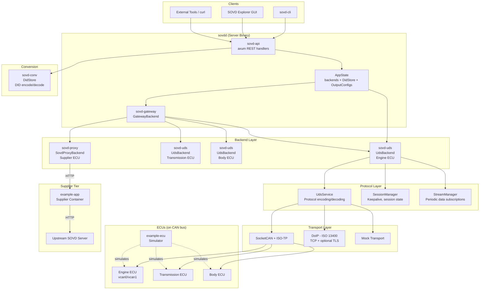
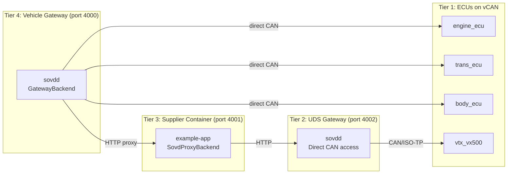
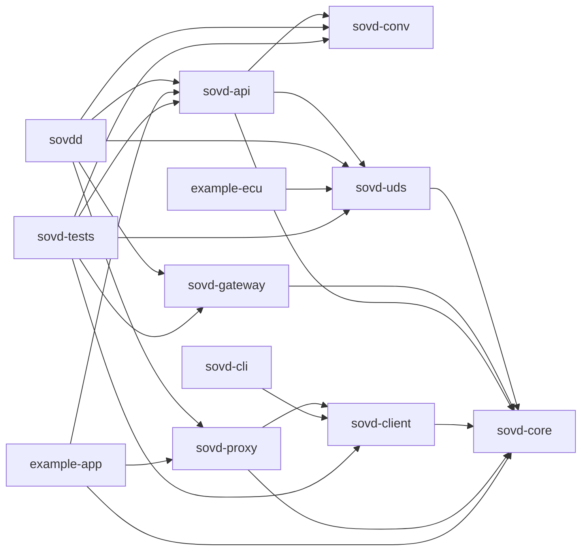
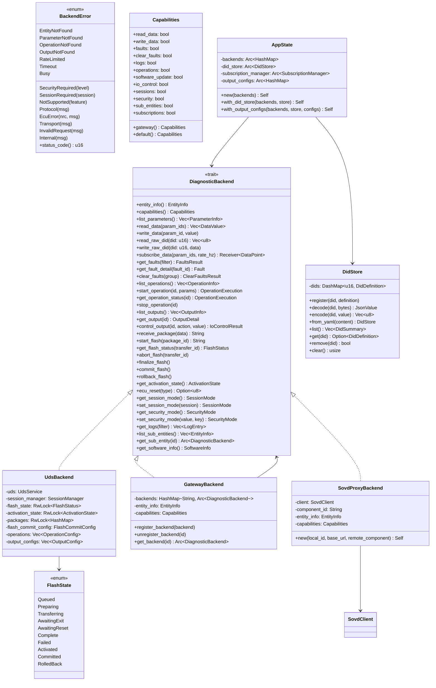
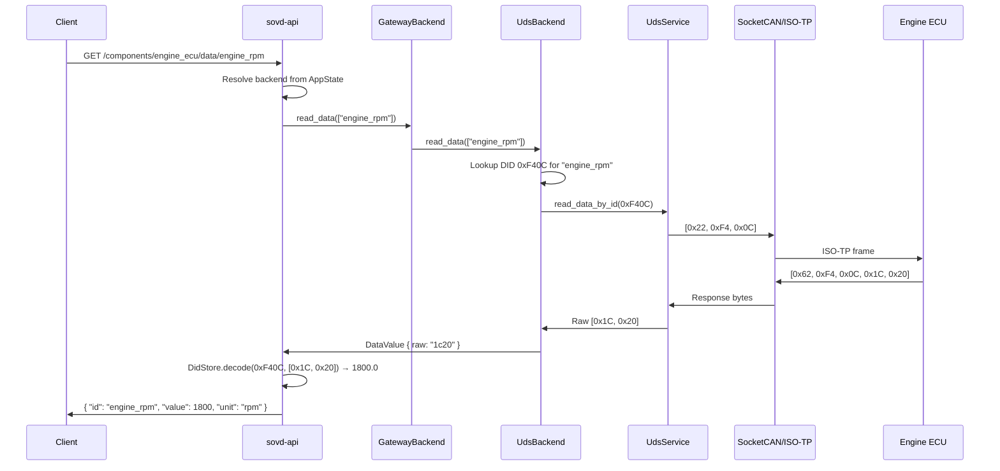
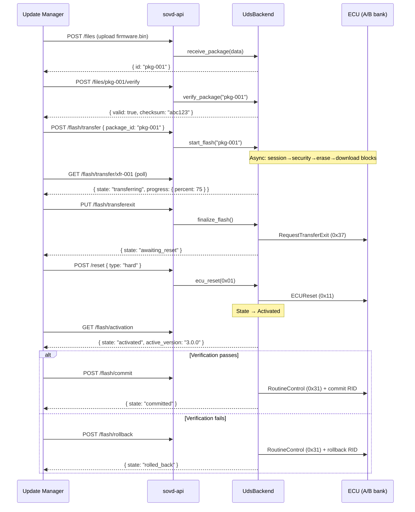
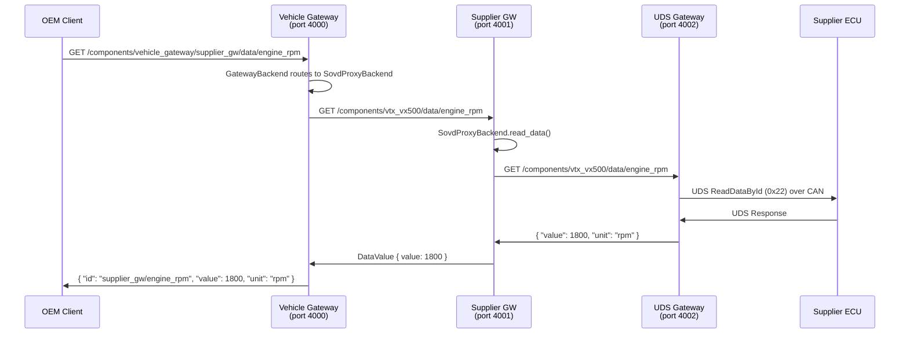
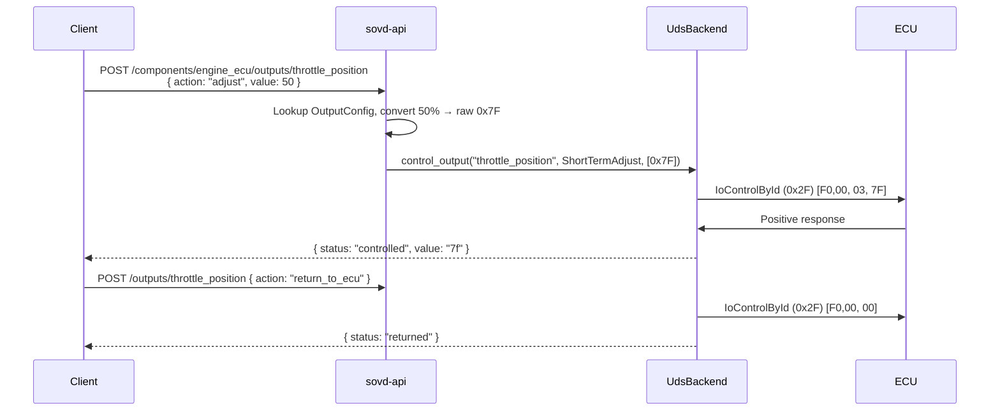
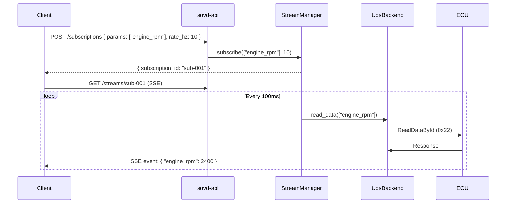

# Architecture: SOVDd

## Overview

SOVDd is a Rust-based SOVD (Service-Oriented Vehicle Diagnostics) server that translates ASAM SOVD REST API calls into UDS (Unified Diagnostic Services) commands for communicating with automotive ECUs over CAN/ISO-TP or DoIP. It targets diagnostic tool developers, OEMs, and automotive test engineers who need a modern HTTP-based interface to traditional vehicle diagnostics.

**Stack:** Rust 2021 edition, axum (HTTP), tokio (async runtime), socketcan/ISO-TP (CAN bus), doip-sockets (DoIP/ISO 13400), parking_lot (concurrency), serde (serialization).

| Language | Files | Code Lines |
|----------|-------|------------|
| Rust     | 111   | 25,490     |
| TOML     | 30    | 2,268      |
| Shell    | 12    | 1,292      |
| YAML     | 10    | 1,161      |
| Markdown | 28    | (docs)     |
| JSON     | 1     | 471        |
| **Total**| **192** | **~33,500** |

## Project Structure

```
SOVDd/
├── Cargo.toml                    # Workspace root (12 crates)
├── ARCHITECTURE.md               # This file
├── README.md                     # Project overview & API reference
├── PLAN.md                       # Development roadmap
│
├── crates/
│   ├── sovd-core/                # Core traits & types (DiagnosticBackend, FlashState, models)
│   ├── sovd-api/                 # HTTP REST layer (axum handlers, routing, AppState)
│   ├── sovd-uds/                 # UDS backend (CAN/ISO-TP, DoIP, session mgmt, flash, subscriptions)
│   ├── sovd-gateway/             # Multi-ECU aggregation (federated backend routing)
│   ├── sovd-conv/                # DID encoding/decoding (YAML definitions, scalars/arrays/maps/histograms)
│   ├── sovd-client/              # Typed HTTP client library (SovdClient, FlashClient, Subscription)
│   ├── sovd-proxy/               # SOVD-over-HTTP proxy backend (for supplier containers without CAN)
│   ├── sovdd/                    # Server binary (config loading, bootstrap)
│   ├── sovd-cli/                 # CLI tool (clap-based, table/JSON/CSV output)
│   ├── example-ecu/              # ECU simulator (UDS over vcan, flash with A/B bank simulation)
│   ├── example-app/              # Example app entity binary (proxies to upstream SOVD server)
│   └── sovd-tests/               # E2E integration tests (serial execution on vcan0)
│
├── config/                       # Example configs
│   ├── sovd.toml                 # Default config (mock transport)
│   ├── sovd-socketcan.toml       # SocketCAN config
│   ├── gateway-socketcan.toml    # Multi-ECU gateway config
│   ├── gateway-dual-ecu.toml     # Dual-ECU gateway config
│   ├── gateway-vortex.toml       # Vortex Motors OEM config
│   ├── example-ecu-standard.toml  # Standard example ECU config
│   ├── example-ecu-vortex.toml    # Vortex Motors example ECU config
│   ├── did-definitions/          # YAML DID definition files
│   │   └── engine_ecu.did.yaml
│   └── parameters/
│       └── vtx_ecm.toml          # VTX ECM parameter definitions
│
├── simulations/                  # Multi-ECU simulation scripts
│   ├── lib/common.sh             # Shared simulation library (ECU/server/helper management)
│   ├── basic_uds/                # 3 ECUs + gateway simulation
│   └── supplier_ota/             # 4-tier supplier proxy architecture simulation
│
├── docs/                         # Design docs, API reference, SOVD specs
├── scripts/
│   └── setup-vcan.sh             # Virtual CAN interface setup
├── build-and-test.sh             # Build/test convenience script
├── run-e2e-tests.sh              # E2E test runner
├── install-deps.sh               # Dependency installer (multi-distro)
└── tests/fixtures/               # Test fixture data (YAML definitions)
```

## System Architecture



### Supplier OTA Reference Architecture (4-tier)



The supplier container has NO direct CAN access. It reaches its ECU exclusively through HTTP, enabling tier-1 suppliers to run diagnostic containers within OEM vehicle gateways.

## Module Hierarchy

### sovd-core (Foundation)
**Purpose:** Defines the `DiagnosticBackend` trait and all shared types. Every other crate depends on this.

| Export | Description |
|--------|-------------|
| `DiagnosticBackend` | Core async trait (~35 methods) for data, faults, operations, outputs, flash, modes, logs, app entities |
| `FlashState` | 10-variant enum: Queued, Preparing, Transferring, AwaitingExit, AwaitingReset, Complete, Failed, Activated, Committed, RolledBack |
| `BackendError` | 14-variant error enum with HTTP status code mapping |
| `EntityInfo`, `Capabilities` | Component identity and feature flags (12 boolean capabilities) |
| `DataValue`, `DataPoint` | Parameter values with metadata and streaming data points |
| `Fault`, `FaultFilter`, `FaultsResult`, `ClearFaultsResult` | DTC/fault domain types |
| `OperationInfo`, `OperationExecution`, `OperationStatus` | Routine control types |
| `OutputInfo`, `OutputDetail`, `IoControlAction`, `IoControlResult` | I/O control types (UDS 0x2F) |
| `SessionMode`, `SecurityMode`, `SecurityState` | Mode management types |
| `LinkMode`, `LinkControlResult` | Link control types (UDS 0x87) |
| `LogEntry`, `LogFilter`, `LogPriority`, `LogStatus` | Log types (HPC/message passing) |
| `SoftwareInfo`, `PackageInfo`, `FlashStatus`, `FlashProgress`, `ActivationState` | Software update types |
| `ParameterInfo` | Parameter metadata (id, name, DID, unit, type, read_only) |

**Source files:** `lib.rs`, `error.rs`, `traits.rs`, `models/` (mod.rs, data.rs, entity.rs, fault.rs, flash.rs, log.rs, mode.rs, operation.rs, output.rs, software.rs)

### sovd-uds (UDS Backend)
**Purpose:** The primary backend implementation. Translates `DiagnosticBackend` calls into UDS protocol messages.

| Module | Description |
|--------|-------------|
| `backend.rs` | `UdsBackend` struct implementing `DiagnosticBackend` (~1600 lines) |
| `config.rs` | `UdsBackendConfig`, `TransportConfig`, `SessionConfig`, `ServiceOverrides`, `FlashCommitConfig` |
| `uds/mod.rs` | `UdsService`, `ServiceIds`, `PeriodicRate`, NRC codes, service ID constants |
| `uds/client.rs` | Protocol-level UDS operations: ReadDataById, WriteDataById, SecurityAccess, RoutineControl, RequestDownload, TransferData, ECUReset, IOControlById, LinkControl, ReadDTCInfo, ClearDiagnosticInfo |
| `uds/dtc.rs` | DTC parsing: `DtcCategory`, `DtcStatus`, sub-function codes, status bit definitions, `format_dtc_code()` |
| `uds/standard_dids.rs` | ISO 14229-1 Annex C standard DID definitions, auto-registration |
| `transport/mod.rs` | `TransportAdapter` trait (async send/receive bytes) |
| `transport/socketcan/` | Linux SocketCAN + ISO-TP adapter (29-bit extended CAN IDs) |
| `transport/doip/` | DoIP adapter (ISO 13400): TCP/TLS, routing activation, vehicle discovery, keep-alive, reconnection |
| `transport/doip/discovery.rs` | UDP broadcast gateway discovery (VIR/VAM), `DiscoveredGateway` |
| `transport/mock.rs` | Mock transport for testing (configurable latency) |
| `session.rs` | `SessionManager` for tester-present keepalive (0x3E) and session state tracking |
| `subscription.rs` | `StreamManager` for periodic DID polling (emulates UDS 0x2A) |
| `output_conv.rs` | Typed I/O control value conversion (physical value ↔ raw bytes) |

### sovd-api (HTTP Layer)
**Purpose:** Backend-agnostic REST API. Routes HTTP requests to `DiagnosticBackend` methods.

| Module | Description |
|--------|-------------|
| `handlers/components.rs` | `GET /components`, `GET /components/:id` |
| `handlers/data.rs` | Parameter list, read, write, raw DID access, batch read, gateway routing |
| `handlers/faults.rs` | Fault listing (with category/status filters), detail, clear, active DTCs |
| `handlers/operations.rs` | Operation listing and execution (RoutineControl 0x31) |
| `handlers/outputs.rs` | I/O control listing, detail, and control (UDS 0x2F) |
| `handlers/flash.rs` | Flash transfer start/status/abort, finalize (transfer exit), commit, rollback, activation state |
| `handlers/files.rs` | Package upload, listing, verification, deletion |
| `handlers/modes.rs` | Session (0x10), security (0x27), and link control (0x87) |
| `handlers/streams.rs` | SSE streaming for real-time data |
| `handlers/subscriptions.rs` | Subscription CRUD (create, list, get, delete) |
| `handlers/definitions.rs` | Admin DID definition management (upload YAML, list, get, delete, clear) |
| `handlers/discovery.rs` | ECU discovery |
| `state.rs` | `AppState` (backends map + DidStore + OutputConfigs + SubscriptionManager) |
| `router.rs` | Route definitions and middleware (CORS, tracing, timeout) |

### sovd-gateway (Aggregation)
**Purpose:** Federates multiple backends into a unified view. The gateway itself implements `DiagnosticBackend` with app entities.

| Export | Description |
|--------|-------------|
| `GatewayBackend` | Aggregates N backends, routes by `backend_id/param_id` prefix, merges parameter/fault/operation lists |
| Methods | `register_backend()`, `unregister_backend()`, `get_backend()`, `backend_ids()` |
| Routing | Parameters prefixed with `backend_id/` (e.g., `engine_ecu/rpm`). Subscription requires all params from same backend. |
| Capabilities | Aggregated OR of all backend capabilities. `sub_entities` always true. |

### sovd-conv (DID Conversion)
**Purpose:** Encodes/decodes automotive DID data with YAML-driven definitions.

| Export | Description |
|--------|-------------|
| `DidStore` | Thread-safe DID registry (DashMap) with encode/decode |
| `DidDefinition` | Definition: type, scale, offset, unit, enum, bitfield, map, array, histogram, byte_order |
| `DataType` | Uint8/16/32, Int8/16/32, Float32/64, String, Bytes |
| `Shape` | Scalar, Array (labeled), Map (2D with breakpoint axes), Histogram (binned) |
| `BitField` | Single-bit flags and multi-bit fields (with width parameter) |
| `ByteOrder` | Big (default), Little endian support |
| `from_yaml()` | Parse YAML definition files with metadata, enum maps, bitfield specs |

### sovd-client (Client Library)
**Purpose:** Typed HTTP client for consuming SOVD APIs.

| Export | Description |
|--------|-------------|
| `SovdClient` | Main client: components, data (single/batch/raw), faults, operations, outputs, modes (session/security/link), logs, apps, subscriptions, ECU reset, definitions management |
| `FlashClient` | Firmware update client: upload, verify, flash, poll progress, transfer exit, ECU reset, commit, rollback. Builder pattern via `FlashConfig::builder()`. |
| `Subscription` | SSE stream consumer with `SseParser`, reconnection, cancellation |
| `StreamEvent` | Parsed SSE event: timestamp, sequence, values HashMap |
| `testing::TestServer` | In-process test server (axum + random port) for unit testing |
| Types | Complete SOVD domain model: `Component`, `DataResponse`, `FaultInfo`, `OperationInfo`, `OutputInfo`, `SessionType`, `SecurityLevel`, `FlashStatus`, etc. |

### sovd-proxy (HTTP Proxy Backend)
**Purpose:** Enables supplier containers without CAN access to participate in SOVD by proxying `DiagnosticBackend` calls over HTTP to a remote SOVD server.

| Export | Description |
|--------|-------------|
| `SovdProxyBackend` | Implements `DiagnosticBackend` by delegating all calls to a `SovdClient` targeting a remote SOVD server |

**Key behaviors:**
- Caches `EntityInfo` and `Capabilities` from remote at initialization
- Maps all `SovdClientError` to `BackendError` (404→EntityNotFound, 403→SecurityRequired, etc.)
- Converts binary data to/from hex strings for HTTP transport
- Supports: data read/write, raw DID, faults, operations, I/O control, logs, sessions, security, app entities
- Does NOT support: subscriptions, software update (phase 2)

### sovdd (Server Binary)
**Purpose:** Entry point. Loads TOML config, creates backends, starts HTTP server.

**CLI:** `sovdd [config.toml] [-d/--did-definitions <path>...]`

**Configuration loading:**
1. Parse CLI args (config file path, DID definition paths)
2. Load TOML config: `[server]`, `[transport]`, `[session]`, `[service_overrides]`, `[ecu.*]`, `[proxy.*]`, `[gateway]`
3. Create `UdsBackend` for each `[ecu.*]` section
4. Create `SovdProxyBackend` for each `[proxy.*]` section
5. Optionally create `GatewayBackend` if `[gateway]` enabled
6. Load DID definitions from YAML files and inline `[[params]]`
7. Register standard DIDs (ISO 14229-1)
8. Build `AppState` and start axum server

### sovd-cli (CLI Tool)
**Purpose:** Command-line diagnostic tool with subcommands for all SOVD operations.

| Command | Description |
|---------|-------------|
| `list <ecu>` | List ECU components |
| `info <ecu>` | Show ECU details |
| `data <ecu>` | List available parameters |
| `read <ecu> [params...] --all` | Read parameter(s) |
| `write <ecu> <param> <value>` | Write parameter value |
| `faults <ecu> [--active] [--clear]` | Manage DTCs |
| `monitor <ecu> <params...> [--rate Hz]` | Real-time SSE streaming |
| `session <ecu> <type>` | Change UDS session |
| `unlock <ecu> [--level] [--key]` | Security access |
| `outputs <ecu>` | List I/O outputs |
| `actuate <ecu> <output> <action> [value]` | Control output |
| `flash <ecu> <file>` | OTA firmware update |
| `reset <ecu> [--reset-type]` | Reset ECU |
| `ops <ecu>` / `run <ecu> <op>` | List/execute operations |

**Output formats:** table (default), JSON, CSV. Config: `~/.config/sovd-cli/config.toml`

### example-ecu (ECU Simulator)
**Purpose:** Simulates a UDS ECU on vcan for development/testing. Supports all UDS services including flash with A/B bank simulation.

**Features:** DiagnosticSessionControl (0x10), ECUReset (0x11), ReadDTCInfo (0x19), ReadDataById (0x22), SecurityAccess (0x27), ReadPeriodicId (0x2A), WriteDataById (0x2E), IOControlById (0x2F), RoutineControl (0x31), RequestDownload (0x34), TransferData (0x36), RequestTransferExit (0x37), TesterPresent (0x3E)

**Config-driven:** Supports TOML config for transport settings, CAN IDs, and transfer block counter behavior.

### example-app (App Entity with Managed ECU Sub-Entity)
**Purpose:** Example SOVD app entity binary demonstrating the §6.5 entity model. The `ExampleAppBackend` (entity_type: "app") exposes synthetic computed parameters and owns a `ManagedEcuBackend` sub-entity (entity_type: "ecu") that proxies diagnostics, intercepts OTA packages, and manages flash transfers to an upstream ECU via `SovdProxyBackend`.

**CLI:** `example-app [--port 4001] [--upstream-url http://...] [--upstream-component <id>]`

### sovd-tests (Integration Tests)
**Purpose:** End-to-end tests running against real example-ecu instances on vcan0.

**Test suites:**
- `e2e_test.rs` — Full test harness: spawns example-ecu + sovdd, exercises REST API (data, faults, flash, operations, I/O control, sessions, security, streaming)
- `gateway_e2e_test.rs` — Gateway-specific tests using `gateway-socketcan.toml`
- `api_integration_test.rs` — Placeholder API integration tests

### Module Dependency Graph



## Core Types



## Data Flow

### 1. Read Parameter (e.g., Engine RPM)



### 2. Firmware Update (Flash with Commit/Rollback)



### 3. Proxy Chain (Supplier Container → ECU)



### 4. I/O Control (Actuator Test)



### 5. Real-Time Data Streaming (SSE)



## State Management

| State | Type | Location | Reads | Writes |
|-------|------|----------|-------|--------|
| Backend map | `HashMap<String, Arc<dyn DiagnosticBackend>>` | `AppState.backends` | All handlers | Bootstrap only |
| DID definitions | `DidStore` (DashMap internally) | `AppState.did_store` | Data handlers, flash | Bootstrap, admin API |
| Output configs | `HashMap<String, HashMap<String, OutputConfig>>` | `AppState.output_configs` | Output handlers | Bootstrap only |
| Flash transfer | `RwLock<Option<FlashTransferState>>` | `UdsBackend.flash_state` | Flash handlers | `start_flash`, `finalize_flash`, `abort_flash` |
| Activation state | `RwLock<ActivationState>` | `UdsBackend.activation_state` | Activation handler | `finalize_flash`, `ecu_reset`, `commit_flash`, `rollback_flash` |
| Stored packages | `RwLock<HashMap<String, PackageData>>` | `UdsBackend.packages` | Flash start | `receive_package`, `delete_package` |
| Session state | `SessionManager` (AtomicU8) | `UdsBackend.session_manager` | All UDS calls | `set_session_mode`, auto-keepalive |
| Subscriptions | `SubscriptionManager` (RwLock) | `AppState.subscription_manager` | Stream handlers | Create/delete subscription |
| ECU simulator state | `SimulatedEcu` (Atomics + RwLocks) | `example-ecu` process | UDS request handlers | UDS writes, flash simulation |
| Proxy entity cache | `EntityInfo`, `Capabilities` | `SovdProxyBackend` | All proxy calls | Init only (cached from remote) |

**Lifecycle:** State is initialized at server startup from TOML config. Flash and activation states reset when a new flash transfer starts. Session state auto-resets on timeout. Subscriptions are ephemeral (lost on restart). Proxy state is fetched once at startup.

## API / Command Reference

### SOVD REST Endpoints (41+ routes)

| Method | Path | Handler | UDS Service | Description |
|--------|------|---------|-------------|-------------|
| GET | `/health` | inline | — | Health check |
| GET | `/vehicle/v1/components` | `list_components` | — | List all ECU components |
| GET | `/vehicle/v1/components/:id` | `get_component` | — | Get component details |
| GET | `/vehicle/v1/components/:id/data` | `list_parameters` | — | List data parameters |
| GET | `/vehicle/v1/components/:id/data/:param` | `read_parameter` | 0x22 | Read parameter value |
| PUT | `/vehicle/v1/components/:id/data/:param` | `write_parameter` | 0x2E | Write parameter value |
| GET | `/vehicle/v1/components/:id/did/:did` | `read_did` | 0x22 | Read raw DID |
| PUT | `/vehicle/v1/components/:id/did/:did` | `write_did` | 0x2E | Write raw DID |
| GET | `/vehicle/v1/components/:id/faults` | `list_faults` | 0x19 | List DTCs |
| DELETE | `/vehicle/v1/components/:id/faults` | `clear_faults` | 0x14 | Clear DTCs |
| GET | `/vehicle/v1/components/:id/faults/:fid` | `get_fault` | 0x19 | Get fault detail |
| GET | `/vehicle/v1/components/:id/dtcs` | `list_active_dtcs` | 0x19 | Active DTCs only |
| POST | `/vehicle/v1/components/:id/data-definitions` | `create_data_definition` | 0x2C | Define DDID |
| DELETE | `/vehicle/v1/components/:id/data-definitions/:ddid` | `delete_data_definition` | 0x2C | Clear DDID |
| GET | `/vehicle/v1/components/:id/operations` | `list_operations` | — | List routines |
| POST | `/vehicle/v1/components/:id/operations/:op` | `execute_operation` | 0x31 | Start routine |
| GET | `/vehicle/v1/components/:id/outputs` | `list_outputs` | — | List I/O controls |
| GET | `/vehicle/v1/components/:id/outputs/:out` | `get_output` | — | Output detail |
| POST | `/vehicle/v1/components/:id/outputs/:out` | `control_output` | 0x2F | Control output |
| GET | `/vehicle/v1/components/:id/logs` | `get_logs` | — | Get logs |
| GET | `/vehicle/v1/components/:id/logs/:lid` | `get_log` | — | Get log entry |
| DELETE | `/vehicle/v1/components/:id/logs/:lid` | `delete_log` | — | Delete log |
| GET | `/vehicle/v1/components/:id/apps` | `list_apps` | — | List app entities |
| GET | `/vehicle/v1/components/:id/apps/:aid` | `get_app` | — | Get app entity |
| POST | `/vehicle/v1/components/:id/subscriptions` | `create_subscription` | 0x2A | Subscribe to data |
| GET | `/vehicle/v1/components/:id/streams` | `stream_data` | 0x2A | SSE data stream |
| GET/POST | `/vehicle/v1/subscriptions` | list/create | — | Global subscriptions |
| GET/DELETE | `/vehicle/v1/subscriptions/:sid` | get/delete | — | Manage subscription |
| GET | `/vehicle/v1/streams/:sid` | `stream_subscription` | — | SSE for subscription |
| POST | `/vehicle/v1/components/:id/reset` | `ecu_reset` | 0x11 | ECU reset |
| GET/PUT | `/vehicle/v1/components/:id/modes/session` | get/set session | 0x10 | Session control |
| GET/PUT | `/vehicle/v1/components/:id/modes/security` | get/set security | 0x27 | Security access |
| GET/PUT | `/vehicle/v1/components/:id/modes/link` | get/set link | 0x87 | Link control |
| POST | `/vehicle/v1/discovery` | `discover_ecus` | — | ECU discovery |
| POST/GET | `/vehicle/v1/components/:id/files` | upload/list | — | Package management |
| GET/DELETE | `/vehicle/v1/components/:id/files/:fid` | get/delete | — | Package operations |
| POST | `/vehicle/v1/components/:id/files/:fid/verify` | `verify_file` | — | Verify package |
| POST/GET | `/vehicle/v1/components/:id/flash/transfer` | start/list | 0x34/0x36 | Flash transfer |
| GET/DELETE | `/vehicle/v1/components/:id/flash/transfer/:tid` | status/abort | 0x37 | Transfer ops |
| PUT | `/vehicle/v1/components/:id/flash/transferexit` | `transfer_exit` | 0x37 | Finalize flash |
| POST | `/vehicle/v1/components/:id/flash/commit` | `commit_flash` | 0x31 | Commit firmware |
| POST | `/vehicle/v1/components/:id/flash/rollback` | `rollback_flash` | 0x31 | Rollback firmware |
| GET | `/vehicle/v1/components/:id/flash/activation` | `get_activation_state` | 0x22 | Activation state |
| GET/POST/DELETE | `/admin/definitions` | CRUD | — | DID definitions admin |
| GET/PUT/DELETE | `/admin/definitions/:did` | CRUD | — | Single DID admin |

## External Dependencies

### Runtime Dependencies

| Crate | Version | Purpose | Replaceable? |
|-------|---------|---------|-------------|
| axum | 0.7 | HTTP framework | Yes (actix-web, warp) |
| tokio | 1 | Async runtime | Core dependency |
| serde / serde_json | 1 | Serialization | No |
| serde_yaml | 0.9 | YAML DID definitions | Yes (yaml-rust2) |
| toml | 0.8 | Config parsing | Yes (config crate) |
| doip-definitions / doip-sockets | git | DoIP (ISO 13400) communication | Optional, git dependency |
| socket2 | 0.5 | Low-level socket options | Tied to transport |
| parking_lot | 0.12 | Fast RwLock/Mutex | Yes (std::sync) |
| chrono | 0.4 | Timestamps | Yes (time crate) |
| thiserror | 1 | Error derive macros | Yes (manual impl) |
| uuid | 1 | Transfer/package IDs | Yes (nanoid, ulid) |
| tower / tower-http | 0.4 / 0.5 | CORS, tracing, timeout middleware | Tied to axum |
| tracing / tracing-subscriber | 0.1 / 0.3 | Structured logging | Yes (log crate) |
| crc32fast | 1.5 | Package checksum | Yes |
| hex | 0.4 | Hex encoding for DID bytes | Yes |
| async-trait | 0.1 | Async trait methods | Rust nightly async-in-traits |
| async-stream / tokio-stream | 0.3 / 0.1 | SSE streaming | Yes (futures-core) |
| reqwest | 0.12 | HTTP client (sovd-client, tests) | Yes (hyper, ureq) |
| url | 2 | URL parsing | Yes (manual) |
| bytes | 1 | Binary data handling | Yes (Vec<u8>) |

### Dev/Test Dependencies

| Crate | Purpose |
|-------|---------|
| reqwest | HTTP client for e2e tests |
| serial_test | Sequential test execution (shared vcan0) |
| tokio-test | Async test utilities |
| axum-test | In-process HTTP testing |
| pretty_assertions | Better test diff output |
| rstest | Parameterized tests |
| tempfile | Temporary file handling |
| mockall | Mock generation |

## Design Patterns & Decisions

### Trait-Based Backend Abstraction
`DiagnosticBackend` is the central abstraction. All ~35 methods have default implementations returning `NotSupported`, so backends only implement what they support. Three implementations exist: `UdsBackend` (direct CAN), `GatewayBackend` (aggregation), and `SovdProxyBackend` (HTTP proxy).

### Gateway as a Backend
`GatewayBackend` itself implements `DiagnosticBackend`, wrapping N child backends. The API layer doesn't need to know whether it's talking to one ECU or a gateway. Parameter IDs are prefixed with `backend_id/` for routing.

### Proxy Pattern for Supplier Isolation
`SovdProxyBackend` enables tier-1 supplier containers to participate in the SOVD ecosystem without direct CAN bus access. The proxy translates all `DiagnosticBackend` calls into HTTP requests to a remote SOVD server, enabling multi-tier architectures where suppliers only interact through standardized HTTP APIs.

### OEM Service Override System
UDS service IDs are configurable per ECU via `ServiceOverrides`. This supports OEMs like Vortex Motors that use non-standard SIDs (e.g., 0xBA instead of 0x2C for DDID). The `ServiceIds` struct resolves overrides at backend creation time.

### DID Conversion Pipeline
Raw DID bytes from ECUs are converted to physical values using `sovd-conv`. Definitions can come from:
1. YAML files loaded at startup (`--did-definitions`)
2. Inline `[[params]]` in TOML config
3. Standard DIDs (ISO 14229-1 Annex C) auto-registered
4. Admin API at runtime (`POST /admin/definitions`)

Supported types: scalar (uint8/16/32, int8/16/32, float32/64), string, bytes, enum, bitfield (single-bit and multi-bit), labeled array, 2D map (with breakpoint axes), histogram.

### Flash State Machine
Firmware updates follow a strict state machine enforced server-side:
```
Queued → Preparing → Transferring → AwaitingExit → AwaitingReset → Activated → Committed/RolledBack
```
- Abort is only valid during active transfer phases (Queued through AwaitingExit)
- After finalization, only commit or rollback is valid (from Activated state)
- `AwaitingReset` enforces that the ECU must reboot before commit/rollback
- Auto-detection reads DID 0xF189 to detect external ECU reboots

### Transport Abstraction
`TransportAdapter` trait abstracts over three transport layers:
- **SocketCAN**: Linux-only, 29-bit extended CAN IDs, ISO-TP framing
- **DoIP (ISO 13400)**: TCP/TLS to DoIP gateways, routing activation, UDP discovery, automatic reconnection, keep-alive
- **Mock**: Configurable latency for testing without hardware

### Thread Safety
- `parking_lot::RwLock` for flash state, activation state, and packages (sync context for read-heavy workloads)
- `DashMap` inside `DidStore` for lock-free concurrent DID lookups
- `AtomicU8` / `AtomicBool` in example-ecu for session and flag state
- Consistent lock ordering: activation_state before flash_state to prevent deadlocks

### Conventions
- Error types carry enough context for HTTP status code mapping (`BackendError::status_code()`)
- All IDs are strings (component IDs, parameter IDs, transfer IDs)
- DIDs are `u16` internally but displayed as hex strings in APIs
- TOML for server config, YAML for DID definitions, JSON for API responses
- Tests run serially (`serial_test`) because they share vcan0
- Simulations use a shared library (`simulations/lib/common.sh`) for consistent process management

## Recreation Blueprint

### 1. Project Scaffolding
```bash
cargo init --name sovdd
# Create workspace with 12 crates:
mkdir -p crates/{sovd-core,sovd-api,sovd-uds,sovd-gateway,sovd-conv,sovd-client,sovd-proxy,sovdd,sovd-cli,example-ecu,example-app,sovd-tests}
# Set up Cargo.toml workspace with shared dependency versions
```

### 2. Core Types (sovd-core)
Define first — everything depends on these:
1. `BackendError` enum with HTTP status mapping
2. Model types: `EntityInfo`, `Capabilities`, `DataValue`, `DataPoint`, `Fault`, `ParameterInfo`, `OperationInfo`, `OutputInfo`, `OutputDetail`, `IoControlAction`, `IoControlResult`, `SessionMode`, `SecurityMode`, `LinkMode`
3. `FlashState` enum, `FlashStatus`, `FlashProgress`, `ActivationState`, `PackageInfo`, `SoftwareInfo`
4. `LogEntry`, `LogFilter`, `LogPriority`, `LogStatus`
5. `DiagnosticBackend` trait with all methods (default impls returning `NotSupported`)

### 3. Build Order

**Phase 1: Foundation**
1. `sovd-core` — traits and types
2. `sovd-conv` — DID encoding/decoding with YAML support (scalars, arrays, maps, histograms, bitfields, enums)

**Phase 2: Backend**
3. `sovd-uds` — UDS protocol layer (`UdsService`, `ServiceIds`, NRC handling, DTC parsing)
4. `sovd-uds` — Transport adapters (Mock first, then SocketCAN, then DoIP)
5. `sovd-uds` — `UdsBackend` implementing `DiagnosticBackend` (data access, faults, operations, I/O control)
6. `sovd-uds` — Session management, keepalive
7. `sovd-uds` — Flash transfer (async task, state machine, progress tracking)
8. `sovd-uds` — Flash commit/rollback with AwaitingReset state

**Phase 3: API**
9. `sovd-api` — `AppState`, router setup, CORS/tracing middleware
10. `sovd-api` — Handlers: components, data (with DID conversion), faults, operations
11. `sovd-api` — Handlers: outputs (I/O control), modes (session/security/link), reset
12. `sovd-api` — Handlers: files, flash transfer, commit/rollback, activation
13. `sovd-api` — Handlers: subscriptions, SSE streaming, definitions admin
14. `sovd-gateway` — `GatewayBackend` wrapping multiple backends

**Phase 4: Proxy**
15. `sovd-client` — HTTP client library (SovdClient, FlashClient, Subscription)
16. `sovd-proxy` — `SovdProxyBackend` implementing `DiagnosticBackend` over HTTP

**Phase 5: Binaries**
17. `sovdd` — Server binary with TOML config loading
18. `sovd-cli` — CLI tool with clap subcommands
19. `example-ecu` — ECU simulator on vcan
20. `example-app` — App entity gateway binary

**Phase 6: Testing**
21. `sovd-tests` — E2E tests using TestServer + example-ecu on vcan0

### 4. Key Implementation Notes

- **ISO-TP framing**: Use `socketcan-isotp` crate for automatic segmentation. 29-bit extended CAN IDs require `ExtendedId`.
- **DoIP transport**: Use `doip-sockets` for TCP/TLS connections. Implement routing activation handshake, keep-alive via alive check requests, and automatic reconnection with retry logic. Vehicle discovery uses UDP broadcast (VIR/VAM).
- **Tester Present**: Must send 0x3E every 2s in non-default sessions or the ECU times out.
- **Flash block counter**: Some ECUs start at 0 (ISO standard), others at 1 (OEM). Configurable via `transfer_data_block_counter_start`. Wraps at 255 back to the start value.
- **Session reset clears transfer state**: Per ISO 14229, switching to default session (0x01) clears any active download. The example-ecu must implement this.
- **Abort cleanup**: After aborting a flash, wait ~100ms for CAN bus drain, then send TransferExit (0x37) to clean up ECU state, then reset to default session.
- **Lock ordering**: Always acquire `activation_state` before `flash_state` to prevent deadlocks.
- **Proxy backend caching**: `SovdProxyBackend` caches entity info and capabilities at init time. The local ID can differ from the remote component ID.

### 5. Configuration
- Copy `simulations/supplier_ota/config/vehicle-gateway.toml` as a reference for multi-tier proxy setup
- Copy `simulations/basic_uds/config/gateway.toml` for multi-ECU gateway setup
- Set up vcan: `sudo modprobe vcan && sudo ip link add vcan0 type vcan && sudo ip link set vcan0 up`
- DID definitions go in `config/did-definitions/` as YAML files
- Security helper (optional): External `SOVD-security-helper` project for key derivation

### 6. Testing
- Unit tests: `cargo test --all --lib`
- E2E tests require vcan0 + example-ecu processes: `cargo test -p sovd-tests --test e2e_test -- --test-threads=1`
- Gateway E2E tests: `cargo test -p sovd-tests --test gateway_e2e_test -- --test-threads=1`
- Simulations: `./simulations/basic_uds/start.sh` (3 ECUs + gateway) or `./simulations/supplier_ota/start.sh` (4-tier proxy)
- Full CI check: `./build-and-test.sh --all` (fmt, clippy, build, test, release build)
