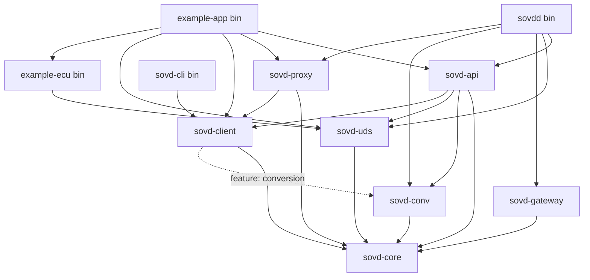

# SOVDd Architecture

**Status:** verified against the source tree on 2026-06-03 (post-ISO-17978-3 conformance refactor).
**Keeping this current:** when you add/retire a route, a `DiagnosticBackend` method, a crate, or a
`FlashState`, update the matching section here. Sections cite `crate/path:line` so drift is easy to spot.
For build/run/test commands see `README.md`; for contributor conventions see `CLAUDE.md`.

---

## 1. Overview & scope

SOVDd is a Rust implementation of an **ASAM / ISO-17978-3 SOVD** (Service-Oriented Vehicle
Diagnostics) server. It exposes a REST API under `/vehicle/v1/` and translates SOVD requests into
**UDS** (ISO-14229) commands over CAN/ISO-TP or DoIP — or federates them across child SOVD servers.

**What SOVDd is:**
- A **spec-first** SOVD/UDS gateway daemon (axum + tokio).
- **Backend-agnostic**: one REST layer over a single trait (`DiagnosticBackend`) with several
  implementations (real UDS, gateway federation, HTTP proxy, reference app-entity).
- **Composable**: gateways nest arbitrarily; an app-entity can curate/own a downstream ECU.

**What SOVDd is *not* (by design — these live in higher layers of the stack):**
- **No authentication / TLS today.** The surface is unauthenticated HTTP; session/security for
  downstream UDS is the *caller's* responsibility (see §13). Client→SOVDd auth (TLS + JWT-bearer) is
  a planned, separate slice.
- **No campaign/fleet orchestration, no SUIT/HSM awareness.** SOVDd is meant to be replaceable and
  *gateway-frontable*; vendor- and hardware-specific concerns sit above/below it, not inside it.

### One disclosed deviation from spec-purity (conformance item C-026)

SOVDd aims for zero vendor routes, but **today it is not vendor-free**: the `/updates` collection
carries three `x-sumo-*` orchestration verbs — `x-sumo-commit`, `x-sumo-rollback`,
`x-sumo-force-rollback` (`crates/sovd-api/src/lib.rs:438-454`) — used to drive trial-mode
commit/rollback for banked components. They are **explicitly disclosed** at
`GET /.well-known/sovd-extensions` (`crates/sovd-api/src/handlers/meta.rs`) so conformance scanners
enumerate them rather than flag them as unknown surface. Whether these verbs stay in SOVDd (with an
amended policy) or move down into the machine-manager layer is the open decision tracked as **C-026**.
This document describes *reality*: spec-first **with one disclosed `sumo` vendor surface**.

---

## 2. Spec posture

- **Base path / version:** `/vehicle/v1`; `version-info` is served at the version-*independent* path
  `/version-info` (C-005) and reports `x-sovd-version: "1.1"` (`handlers/meta.rs`).
- **Capability description (§7.5):** `GET /vehicle/v1/docs` returns a curated OpenAPI 3.1.0 document
  built from a hand-maintained `PATHS` table in `handlers/meta.rs` (axum 0.8 doesn't expose its route
  table, so this is maintained alongside the router — keep them in sync). Per-path scoped `{path}/docs`
  is served via the `not_found_fallback`.
- **Status codes:** restricted to the spec subset (200/201/202/204/400/401/404/405/406/409/415/500/
  501/503/504); non-spec codes (403/412/502/429) were deliberately removed from the wire
  (`crates/sovd-api/src/error.rs`).
- **Section references in code:** the router and handlers are annotated with ISO `§` and `C-NNN`
  conformance IDs — these are the authoritative in-code pointers to which spec clause a route serves.
- **No conformance rubric is checked into this repo**; the machine-readable C-001…C-142 checklist and
  ISO prose live outside it.

---

## 3. Workspace layout

A 12-crate Cargo workspace (`Cargo.toml`): 7 libraries, 4 binaries, 1 test crate.

| Crate | Kind | Responsibility |
|---|---|---|
| **sovd-core** | lib | Foundation: the `DiagnosticBackend` trait + all shared models & error types. Everything depends on it. |
| **sovd-conv** | lib | DID encode/decode engine; `DidStore` (DashMap) driven by YAML/TOML definitions. |
| **sovd-uds** | lib | The real backend: `UdsBackend` over UDS/CAN/ISO-TP/DoIP/Mock. |
| **sovd-gateway** | lib | `GatewayBackend` — federates N child backends; itself a `DiagnosticBackend`. |
| **sovd-proxy** | lib | `SovdProxyBackend` — a `DiagnosticBackend` that forwards over HTTP to a remote SOVD server. |
| **sovd-client** | lib | Typed HTTP client (`SovdClient`, `FlashClient`, SSE `Subscription`, `testing::TestServer`). |
| **sovd-api** | lib | Backend-agnostic axum REST layer: router, `AppState`, handlers, error mapping. |
| **sovdd** | **bin** | The server daemon: parse TOML config → build backends → serve axum. |
| **sovd-cli** | **bin** | clap CLI diagnostic tool (talks to a server via sovd-client). |
| **example-ecu** | **bin** | UDS ECU simulator on vcan (A/B-bank flash sim). |
| **example-app** | **bin** | Reference SOVD **app-entity**: synthetic params + a `ManagedEcuBackend` that owns/OTAs an upstream ECU. |
| **sovd-tests** | test | E2E integration tests (real `example-ecu` on vcan). |

### Dependency graph


```mermaid
graph TD
    core[sovd-core]
    conv[sovd-conv] --> core
    uds[sovd-uds] --> core
    gw[sovd-gateway] --> core
    client[sovd-client] --> core
    client -. "feature: conversion" .-> conv
    proxy[sovd-proxy] --> core
    proxy --> client
    api[sovd-api] --> core
    api --> conv
    api --> uds
    api --> client
    sovdd[sovdd bin] --> api
    sovdd --> uds
    sovdd --> gw
    sovdd --> conv
    sovdd --> proxy
    cli[sovd-cli bin] --> client
    eecu[example-ecu bin] --> uds
    eapp[example-app bin] --> api
    eapp --> proxy
    eapp --> client
    eapp --> uds
    eapp --> eecu
```

Notable edges: `sovd-api` depends on both `sovd-uds` **and** `sovd-client`; `example-app` **embeds**
`example-ecu` (it can run a full app→ECU stack in one process).

---

## 4. The `DiagnosticBackend` trait — the central abstraction

Defined in `crates/sovd-core/src/backend.rs` (`#[async_trait] trait DiagnosticBackend: Send + Sync`).
~45 async methods grouped by domain. **Almost every method has a default body returning
`BackendError::NotSupported`**, so a backend implements only what it can do; the API layer treats
"not supported" as a clean 501/empty rather than a special case.

Method groups (see `backend.rs` for the full list):

| Group | Methods (representative) |
|---|---|
| Entity | `entity_info`, `capabilities` |
| Data | `list_parameters`, `read_data`, `write_data`, `read_raw_did`, `write_raw_did`, `define_data_identifier`, `clear_data_identifier`, `subscribe_data` (→ `broadcast::Receiver<DataPoint>`), `ecu_reset` |
| Faults | `get_faults`, `get_fault_detail`, `clear_faults` |
| Logs | `get_logs`, `get_log`, `get_log_content`, `delete_log`, `stream_logs` |
| Operations | `list_operations`, `start_operation`, `get_operation_status`, `stop_operation` |
| I/O control | `list_outputs`, `get_output`, `control_output` |
| Sub-entities | `list_sub_entities`, `get_sub_entity` (→ `Arc<dyn DiagnosticBackend>`) |
| Software / packages | `get_software_info`, `receive_package`, `receive_package_stream` (chunked), `list_packages`, `get_package`, `verify_package`, `verify_part`, `delete_package` |
| Async flash | `start_flash`, `update_shape`, `get_flash_status`, `list_flash_transfers`, `abort_flash`, `finalize_flash`, `validate`, `invalidate`, `activate`, `commit_flash`, `rollback_flash`, `get_activation_state` |
| Modes | `get/set_session_mode`, `get/set_security_mode`, `get/set_link_mode` |

> The trait doc comment names `HpcBackend` and `ContainerBackend` as illustrative future backends —
> these are **not implemented**. The concrete implementations are below.

---

## 5. Backends (implementations of the trait)

### 5.1 `UdsBackend` (`sovd-uds`) — the real diagnostic backend

Talks UDS to ECUs over CAN/ISO-TP or DoIP. This is where UDS pass-through happens (`read_raw_did` →
0x22, `write_raw_did` → 0x2E, `control_output` → 0x2F, `start_operation` → 0x31, flash → 0x34/0x36/
0x37, modes → 0x10/0x27/0x87).

```text
┌─────────────────────────────────────────────────────────────┐
│                      UdsBackend                              │
│  Implements DiagnosticBackend                                │
│  ┌─────────────┐  ┌─────────────┐  ┌─────────────────────┐  │
│  │ EcuConfig   │  │ SessionMgr  │  │ SubscriptionMgr     │  │
│  │ (params)    │  │ (state)     │  │ (periodic data)     │  │
│  └─────────────┘  └─────────────┘  └─────────────────────┘  │
│                          │                                   │
│                    ┌─────┴─────┐                             │
│                    │UdsService │ (protocol)                  │
│                    └─────┬─────┘                             │
│                 ┌────────┴────────┐                          │
│                 │TransportAdapter │ (SocketCAN / DoIP / Mock)│
│                 └─────────────────┘                          │
└─────────────────────────────────────────────────────────────┘
```

- **Transports** (`transport/`): `socketcan/` (ISO-TP framing + a `scanner.rs` for CAN auto-discovery),
  `doip/` (TCP, ISO-13400, incl. `discovery.rs`), `mock.rs`. **Feature-gated:** `default = ["socketcan"]`
  and **DoIP is opt-in** (`crates/sovd-uds/Cargo.toml`); socketcan crates are `cfg(target_os = "linux")`.
- **Sessions** (`session.rs`): auto-sends TesterPresent (0x3E) every ~2 s in non-default sessions;
  `notify_ecu_reset()` records that an ECU reverts to default session + re-locks security after 0x11.
- **Subscriptions** (`subscription.rs`): `StreamManager` polls DIDs periodically to emulate UDS 0x2A.

### 5.2 `GatewayBackend` (`sovd-gateway`) — federation

Wraps N child backends keyed by each child's `entity_info().id`, and is itself a `DiagnosticBackend`.

```text
┌──────────────────────────────────────────────────────────┐
│                     SOVD Gateway                          │
│   ┌──────────────────────────────────────────────────┐   │
│   │                 GatewayBackend                    │   │
│   │  - registers child backends                       │   │
│   │  - routes by `child_id/local_id` prefix           │   │
│   │  - exposes children as sub-entities               │   │
│   └───────────────┬──────────────────────────────────┘   │
│           ┌───────┼───────┐                               │
│           ▼       ▼       ▼                               │
│      UdsBackend  UdsBackend  (proxy/app/…)                │
└──────────────────────────────────────────────────────────┘
```

- **Routing:** child resources are addressed `child_id/local_id`; helpers in
  `crates/sovd-core/src/routing.rs` split/join prefixes. List methods fan out to all children and
  re-prefix ids + rewrite `href`s back to the gateway path.
- **Capabilities:** the gateway advertises **gateway-class** capabilities (notably `sub_entities`);
  a client reads each child's real capabilities from that child's own `GET /components/{gw}/{child}`
  detail — not a naive union.
- **Addressing nuance (C-021):** the *flat* gateway data path was retired. Child-ECU data is addressed
  **only** via the sub-entity path `/apps/{child}/data/{param}` (see §7), giving one canonical
  data-addressing route. Gateways nest arbitrarily (tested to 4 tiers).

### 5.3 `SovdProxyBackend` (`sovd-proxy`) — HTTP pass-through

A `DiagnosticBackend` that forwards every call over HTTP to a *remote* SOVD server via an embedded
`SovdClient`. Caches the remote's `EntityInfo`/`Capabilities` at construction ("upstream is
authoritative") and supports a `sub_entity_prefix` so it can target a child behind a remote gateway.
This is what lets one SOVDd front another (multi-tier supplier topologies).

### 5.4 `ExampleAppBackend` / `ManagedEcuBackend` (`example-app`) — reference app-entity

The reference SOVD **app-entity** (ISO §6.5): it exposes synthetic params and owns a
`ManagedEcuBackend` that proxies/OTAs an upstream ECU. Demonstrates the supplier pattern:
- **Two-level sessions:** an outer app session gates flash; the inner ECU session is driven via
  `SovdProxyBackend` to the upstream server.
- **Internal security:** the app holds the supplier's seed-key secret and authenticates the inner ECU
  itself — external clients never see it (`set_security_mode` → `NotSupported`).
- **Parameter whitelist:** only configured params are exposed, letting a tier-1 curate what the OEM sees.

---

## 6. HTTP API layer (`sovd-api`)

### 6.1 Router assembly & middleware

`create_router(state: AppState) -> Router` in `crates/sovd-api/src/lib.rs` builds one flat router with
`.route(...)` per path, then:
- `.fallback(meta::not_found_fallback)` + `.method_not_allowed_fallback(meta::method_not_allowed_fallback)`
  so **404/405 bodies are spec `GenericError`**, not axum plain text. (The 404 fallback also serves the
  per-path `{path}/docs` capability scoping, since axum can't express a non-final wildcard.)
- Middleware (`lib.rs:475-477`): `DefaultBodyLimit::disable()` (for ASAM SOVD chunked uploads),
  `TraceLayer::new_for_http()`, and a **fully permissive `CorsLayer`** (`Any` origin/method/header).
- `.with_state(state)`.

> There is **no auth/TLS layer** here today — a JWT-validation middleware + rustls would attach above
> these layers when the auth slice lands.

### 6.2 Route groups (in router order)

health · meta (`/version-info`, `/vehicle/v1/docs`, `/.well-known/sovd-extensions`) · components · data
(+ `?raw=true` for raw DID) · data-lists (define-data operation + read/clear) · faults (+ `?active_only=true`,
`delete_fault`) · logs (+ `entries`, `config`) · **spec-presence stub collections** (configurations, locks, triggers,
communication-logs, scripts, data-categories, data-groups, modes/communication-control, modes/dtc-setting —
present for spec coverage, backend wiring TODO, honest 501s) · clear-data · operations (+ async `executions`,
covering UDS 0x31 **and** 0x2F per C-133) · apps (sub-entity tree, §7) · cyclic-subscriptions + streams (SSE) ·
status/restart (ECU reset, §7.19) · modes (session/security/link = UDS 0x10/0x27/0x87) · discovery · updates
(+ bulk-data, prepare/execute/automated/status, and the disclosed `x-sumo-*` verbs) · `/admin/definitions`
(runtime DID-definition CRUD — note: **outside** `/vehicle/v1`).

**Retired routes** (do not re-add; see git history): `/flash/*`, `/files/*`, `/outputs/*`, `/dtcs`,
`/data-definitions/{ddid}`, the flat gateway data path, and the legacy `/executions{action}` vendor wire.

### 6.3 Handler organization

One module per domain in `crates/sovd-api/src/handlers/`: `components`, `data`, `data_lists`,
`clear_data`, `faults`, `logs` + `logs_ext`, `operations`, `modes`, `reset`, `streams`, `subscriptions`,
`sub_entity` (the entire `/apps/{app_id}/...` tree), `updates` (the full `/updates` wire + `x-sumo` verbs),
`stubs` (the spec-presence stub collections), `definitions` (`/admin`), `discovery`, `apps`, `software`,
and `meta` (version-info, docs, `.well-known`, the 404/405 fallbacks).

### 6.4 Request lifecycle (worked example: `GET .../data/{param}`)

1. **Bind** (`crates/sovdd/src/main.rs`): `TcpListener::bind(0.0.0.0:port)` + `axum::serve` (plain HTTP).
2. **Route** → `data::read_parameter`.
3. **Resolve component:** `state.get_backend(&component_id)?` (`crates/sovd-api/src/state.rs`) → an
   `&Arc<dyn DiagnosticBackend>` or `ApiError::NotFound` (404). This is the *single* resolution point.
4. **Resolve param:** `did_store.resolve_did(param_id)` (hex DID strings like `F190` resolve the same as
   semantic names); fall back to `backend.read_data` for proxy/app backends, else `backend.read_raw_did`.
5. **Decode:** `did_store.decode(did, raw)` → physical value; non-ECU entities can synthesize from
   `entity_info()`.
6. **Respond:** a `DidResponse` (id, value, unit, raw, length, converted, RFC-3339 timestamp), or an
   error funneled through §11.

### 6.5 Vendor data parameters (`x-<ext>-…`)

Backends may expose vendor-specific parameters over the generic `/data` wire:
`list_parameters` advertises them with custom `x-<ext>-` ids (ISO 17978-3 §5.4.5)
and `read_data` serves them. SOVDd routes these with **zero** special-casing — no
vendor name is baked into the server, so it stays spec-pure (cf. §2). The value
may be a structured object, not just a scalar.

Canonical examples (served by sumo-machine-manager's `ComponentBackend`):
- **`x-sumo-installed-manifest`** — `GET …/components/{vm}/data/x-sumo-installed-manifest`
  returns the committed bank's **signature-verified IVD manifest** — per-file
  `{path, sha256}`, the release `identity`, and the signed bytes for independent
  verification — the read a SW-mapping / update tool uses to inventory "what is
  installed" per VM.
- **`x-sumo-update-mode`** — each component's update shape (`banked` vs `singleshot`/
  irreversible, plus `supports_rollback` / `dual_bank` / `reset_kind`), readable any time
  (even pre-flash). Lets an offboard twin sync rollback-capability so a campaign builder
  can refuse to mix rollbackable + irreversible (e.g. HSM) components in one upgrade.

Producer-side contract + verification details:
`sumo-machine-manager/specs/sovd-vm-app-installation.md` §17.

---

## 7. Multi-component, gateways & sub-entities

- A component maps to a backend through `AppState.backends: HashMap<component_id, Arc<dyn DiagnosticBackend>>`.
- Children behind a gateway/app are addressed through the **sub-entity tree**: `sub_entity::resolve`
  walks each `/`-separated segment via `get_sub_entity()`, so `/apps/{a}/apps/{b}/...` supports
  **arbitrarily nested** gateways and proxy chains.
- The canonical multi-tier exercise is `crates/sovd-tests/tests/multilayer_e2e_test.rs`: client →
  Vehicle-Gateway SOVDd (no CAN) → {proxy → SOVDd; proxy → example-app → proxy → SOVDd} →
  `example-ecu` on vcan. `gateway_e2e_test.rs` covers the single-gateway-over-real-vcan case.

---

## 8. Software update / flash

The async flash lifecycle is modeled by **`FlashState`** (13 variants) in `crates/sovd-core/src/backend.rs`,
driven by the trait's flash methods and surfaced over the `/updates` wire. Backends branch on
`supports_rollback`.

**Dual-bank (`supports_rollback = true`)** — activation reboots, then the component runs its own
post-reset health check before the commit/rollback decision:

```text
Queued → Preparing → Transferring → AwaitingActivation ──(optional validate())──► Validated
                                          │ finalize_flash()                          │
                                          ▼                                           │ activate()
                                     AwaitingReboot ◄──(invalidate() demotes)─────────┘
                                          │ ecu_reset()
                                          ▼
                                      Verifying (component-driven post-reset health check)
                                          ▼
                                      Activated (trial mode)
                                       /        \
                               commit()          rollback()
                                  ▼                  ▼
                              Committed          RolledBack
```

**Single-bank (`supports_rollback = false`)** — the artifact write *is* the activation; no reboot,
no trial:

```text
… → Activated ── commit_flash() ──► Complete
```

- `Initial` = factory-fresh (never OTA-flashed). `validate()`/`Validated` are opt-in (re-runnable crypto
  checks for fleet campaigns); the classic `finalize_flash()` path skips them.
- **Abortable:** `Queued`, `Preparing`, `Transferring`, `AwaitingActivation`, `Validated`. Everything
  after `AwaitingReboot` is not abortable — revert via `rollback_flash()` once `Activated`.
- `ActivationState.reset_kind` (`None`/`Local`/`RequiresEcuReset`) lets an orchestrator coalesce resets:
  most components self-cycle (`Local`); host-OS/M7 images need a parent-ECU reboot (`RequiresEcuReset`).
- **Wire (`/updates`, handlers/updates.rs):** `POST /updates` registers; `PUT prepare`/`execute` spawn
  tracked async tasks (`202` + `Location`); `GET status`; `DELETE` aborts via a stored `AbortHandle`.
  **Orchestrated mode** (`PUT execute?x-sumo-control=orchestrated`) pauses at
  `substate=awaiting-verdict` on a `watch` channel until `x-sumo-commit`/`x-sumo-rollback` (or a
  watchdog fires; default 600 s). See the C-026 note in §1 for the vendor-verb status.

---

## 9. Streaming & async execution

- **Cyclic subscriptions** (`handlers/subscriptions.rs`): `SubscriptionManager` =
  `RwLock<HashMap<id, CyclicSubscription>>`. Create → `201` + `Location` + a `Link` header advertising
  the SSE URL. Cadence is a coarse enum (Fast/Normal/Slow → 20/5/2 Hz). One `resource` per subscription.
  **Ephemeral** — lost on restart.
- **SSE delivery** (`handlers/streams.rs`): `GET .../streams/{sub_id}` resolves the subscription's
  resource to a DID, calls `backend.subscribe_data(...)` → `broadcast::Receiver<DataPoint>`, and maps it
  to SSE. Each event is an ISO §5.6 `EventEnvelope` `{timestamp, payload?, error?}`; broadcast **lag** is
  surfaced as an `error` envelope rather than silently dropped. A non-spec inline `GET .../streams?parameters=…`
  reader is kept for the stateless query-style case (manually parses repeated `?parameters=` keys, C-064).
- **Async operations** (`handlers/operations.rs`): `POST .../operations/{op}/executions` → `202` +
  `Location`, runs in a tokio task, client polls `GET .../executions/{id}` (served from a bounded
  per-component `OperationExecutionCache`); `DELETE` → RoutineControl stop.

---

## 10. DID conversion (`sovd-conv`)

Raw ECU bytes ↔ physical values. `DidStore` (lock-free `DashMap`) is populated from four sources:
YAML/JSON files (via `sovdd -d <path>`), inline TOML `[[ecu.x.params]]`, ISO-14229 Annex-C standard DIDs
(auto-registered), and the `/admin/definitions` runtime API. Supported shapes: scalar, array, map,
histogram, bitfield, enum — with scale/offset and byte-order. Shared via `AppState.did_store`.

---

## 11. Error model

A two-stage funnel is the spine of every response:

```
BackendError (sovd-core)  ──From──►  ApiError (sovd-api)  ──IntoResponse──►  (StatusCode, Json<GenericError>)
```

`GenericError` (`crates/sovd-core/src/models/error.rs`): `{error_code, vendor_code?, message,
translation_id?, parameters: map<string, string[]>}`. UDS NRCs surface as `error_code=error-response`
with `parameters:{service, nrc}` at HTTP 409. `error_code` tokens follow ISO Table-18; the `vendor()`
constructor stamps `error_code = "vendor-specific"`. `ApiError::into_response` also splits server-error
vs client-error logging.

---

## 12. Configuration & bootstrap (`sovdd`)

`main.rs` parses one positional TOML config path + repeatable `-d/--did-definitions <path>`. With **no
config** it falls back to mock backends on port **18081**; the shipped sample configs use **9080**
(`config/sovd.toml`), and the gateway/test configs use 18082-18092.

Recognized TOML sections: `[server]` (`port`); `[transport]` (`socketcan`|`mock` + isotp);
`[session]`/`[session.security]`/`[session.keepalive]`; `[service_overrides]` (OEM SID remaps);
`[ecu.<id>]` (transport, params, operations, outputs, flash, session/security, overrides);
`[proxy.<id>]` (`url`, `component_id`, `auth_token`); `[gateway]` (`enabled`, `id`, `scan`).
When `[gateway].enabled`, configured ECUs/proxies are drained into a `GatewayBackend`; `[gateway.scan]`
(Linux) auto-discovers unconfigured ECUs on the CAN bus.

---

## 13. Security model (today)

SOVDd does **not** hold security secrets and is **unauthenticated** at its own surface:
- **Direct UDS access:** the external tester sets session and performs SecurityAccess (0x27) before
  privileged calls (`start_flash`, `commit_flash`, …).
- **App-entity access:** `ManagedEcuBackend` holds the supplier secret internally and manages the inner
  ECU's session/security — transparent to OEM clients.
- **Simulations:** the separate `SOVD-security-helper` service holds seed-key secrets.

Client→SOVDd authentication (TLS termination + JWT-bearer validation + per-client resource filtering,
ISO C-030/031/032) is a planned, cohesive slice — intentionally *not* sprinkled into the current code.

---

## 14. Client & CLI

- **`sovd-client`** — typed async HTTP client: `SovdClient` (read/write/faults/ops/modes), `FlashClient`
  (routes through `/updates` internally), SSE `Subscription`, and `testing::TestServer` for in-process tests.
  An optional `conversion` feature pulls in `sovd-conv`.
- **`sovd-cli`** — clap CLI over `sovd-client` for manual diagnostics.

---

## 15. Testing & simulations

- **E2E (`crates/sovd-tests`)**: real `example-ecu` on `vcan0` (serial — shared bus). `gateway_e2e_test.rs`
  and `multilayer_e2e_test.rs` exercise federation/nesting. See `run-e2e-tests.sh`.
- **Simulations (`simulations/`)**: `basic_uds` (3 ECUs + gateway) and `supplier_ota` (4-tier OTA), each
  with `start.sh`/`stop.sh`/`view-logs.sh` and a `config/` dir; binaries auto-build on start. Shared
  process management in `simulations/lib/common.sh`.

---

## 16. Cross-cutting

- **Logging/tracing:** `tracing` + `tracing-subscriber` env-filter (default per-crate levels in `main.rs`);
  `TraceLayer` on every request.
- **Concurrency:** `parking_lot` mutexes for `AppState` caches; `tokio::sync::RwLock` for the subscription
  registry; `DashMap` inside `DidStore`; `tokio::sync::broadcast` for data subscriptions/SSE.
- **`AppState`** (`crates/sovd-api/src/state.rs`, `Clone` via `Arc` fields): `backends`, `did_store`,
  `subscription_manager`, `output_configs`, `operation_executions` (bounded cache), `log_config`,
  `clear_data_status`, `updates` (per-update tracking; in-memory), `updates_config`.
- **`.well-known` / discovery / admin:** `/.well-known/sovd-extensions` (vendor-extension disclosure),
  `POST /vehicle/v1/discovery` (reads identity DIDs and emits TOML config snippets), `/admin/definitions`
  (runtime DID CRUD, outside `/vehicle/v1`).
- **Versioning:** SOVD API edition `v1`; `x-sovd-version "1.1"`; crate version surfaced in software-info.
